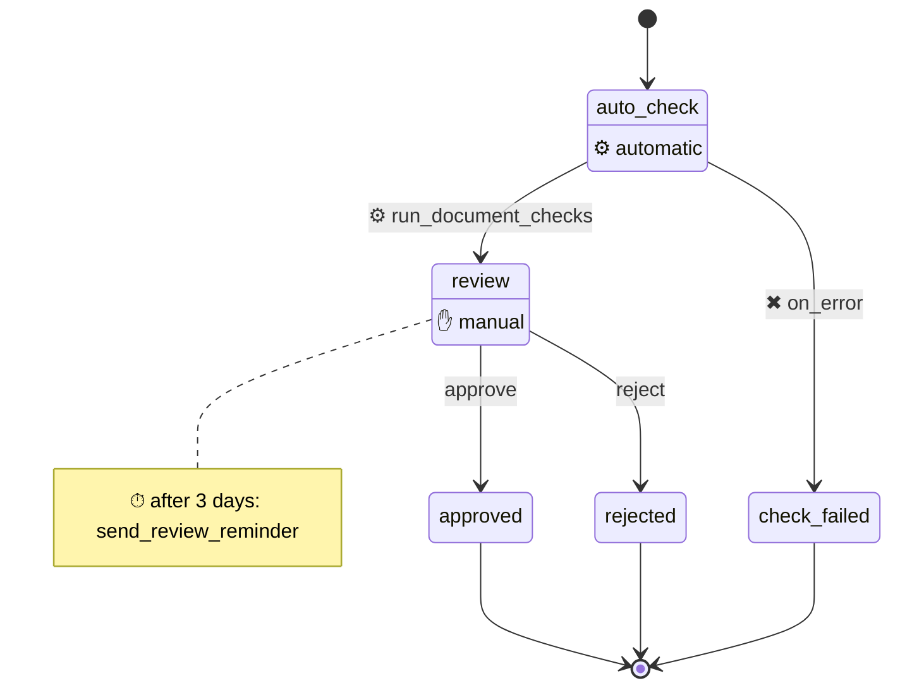
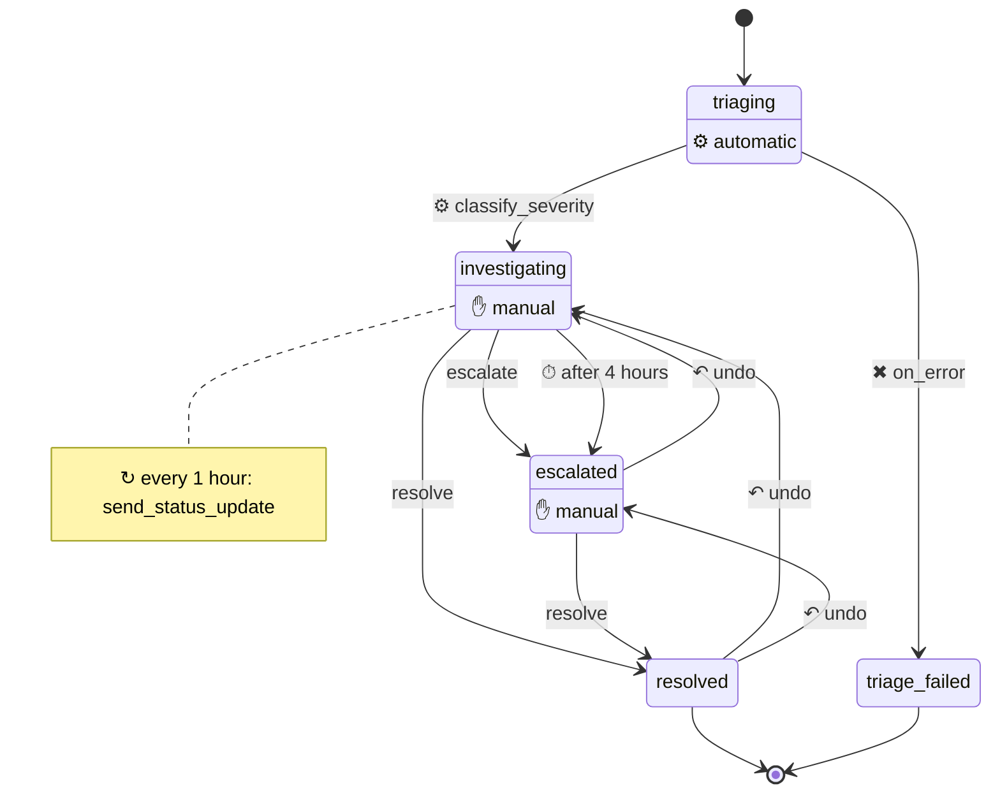
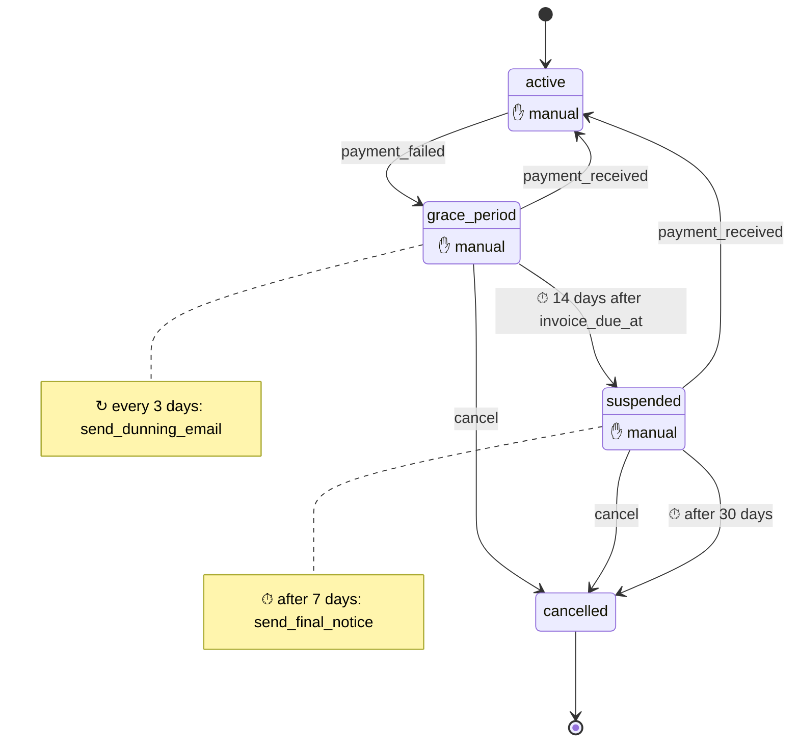
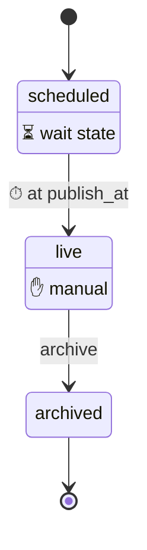

# Diagrams

`AshWorkflow.Charts` draws a workflow from its DSL. The chart shows which
steps are automatic, manual, wait states or terminal. It labels each timeout
with its deadline, gives each conditional route its condition, and draws only
the undo moves the generated `undo` action can make.

`AshStateMachine.Charts` draws the state machine that AshWorkflow generates,
so it works on a workflow resource too. `AshWorkflow.Charts` reads the
workflow DSL in its place, so it can also show what only the DSL knows: step
kinds, deadlines, route conditions, step notes, and the moves that undo can
rewind.

## Drawing a workflow

```elixir
AshWorkflow.Charts.mermaid_state_diagram(MyApp.Candidate)
AshWorkflow.Charts.render(MyApp.Candidate, :json, pretty: true)
```

From the command line:

```bash
mix ash_workflow.diagram MyApp.Candidate
mix ash_workflow.diagram --format json --output priv/diagrams
```

With no resource names, the task draws every resource that uses
`AshWorkflow` in the domains listed under `:ash_domains`. Without `--output`,
it prints the diagrams. With `--output`, it writes one file per resource.

## What a chart shows

This is `BasicWorkflow.DocumentApproval`, from the repository's
`examples/basic` directory. An automatic check runs first and falls to
`check_failed` on an error. Then a reviewer approves or rejects, with a
reminder after 3 days:

<!-- chart: BasicWorkflow.DocumentApproval workflow -->
```elixir
workflow do
  step :auto_check do
    action :run_document_checks
    on_success :review
    on_error :check_failed
  end

  step :review do
    transition :approve, to: :approved
    transition :reject, to: :rejected

    timeout :reminder, fire_after: {3, :days}, action: :send_review_reminder
  end

  step :approved, terminal: true
  step :rejected, terminal: true
  step :check_failed, terminal: true
end
```
<!-- /chart -->

Its chart:

<!-- chart: BasicWorkflow.DocumentApproval mermaid -->

<!-- /chart -->

| In the workflow | In the chart |
|---|---|
| Automatic step | `⚙ automatic` under the step name |
| Manual step | `✋ manual` under the step name |
| Wait state, where a timeout is the only exit | `⏳ wait state` under the step name |
| Initial step | An edge from the start marker |
| Terminal step | An edge to the end marker |
| `on_success` | `⚙` and the step's action |
| `on_error` | `✖ on_error` |
| Timeout with `transition_to` | `⏱` and its deadline: `after 7 days`, `3 days after last_session_date` or `at next_check_at` |
| Conditional route | The transition or action, `when`, and the route's condition. The last `on_success` route without a `when` reads `otherwise` |
| Undo | `↶ undo`, from the step undo leaves to the step it restores |
| Step policy | `policy:` in the step's note, from the check's own `describe/1` |
| `retry` with more than one attempt | `retry:` in the step's note, or after the action in a timeout's or `every`'s note |
| Timeout that runs an action | `⏱`, its deadline and its action in the step's note |
| `every` | `↻`, its schedule and its action in the step's note |

## More examples

Each example is in the repository's `examples/basic` directory. The
definition and the chart are both generated from that code, so they always
agree.

### Undo and a recurring action

`BasicWorkflow.Incident` marks `escalate` and `resolve` as `undoable?: true`.
The undo edges come from `AshWorkflow.Info.undoable_edges/1`, so the chart
shows the same moves that the `undo` action permits. The `every` is a note on
`investigating`, because it runs an action and does not move the record.

<!-- chart: BasicWorkflow.Incident workflow -->
```elixir
workflow do
  transition_log BasicWorkflow.IncidentTransition

  undo do
    within {1, :hours}
  end

  step :triaging do
    action :classify_severity
    on_success :investigating
    on_error :triage_failed
  end

  step :investigating do
    transition :escalate, to: :escalated, undoable?: true
    transition :resolve, to: :resolved, undoable?: true

    every :status_update do
      interval {1, :hours}
      action :send_status_update
    end

    timeout :auto_escalate, fire_after: {4, :hours}, transition_to: :escalated
  end

  step :escalated do
    transition :resolve, to: :resolved, undoable?: true
  end

  step :resolved, terminal: true
  step :triage_failed, terminal: true
end
```
<!-- /chart -->

<!-- chart: BasicWorkflow.Incident mermaid -->

<!-- /chart -->

### A deadline from a date on the record

`BasicWorkflow.Subscription` ends its grace period 14 days after
`invoice_due_at`, a date on the record, not 14 days after the step started.
The chart names the field in the label. The final notice is a timeout that
runs an action, so it is a note, not an edge.

<!-- chart: BasicWorkflow.Subscription workflow -->
```elixir
workflow do
  step :active do
    transition :payment_failed, to: :grace_period, accept: [:invoice_due_at]
  end

  step :grace_period do
    transition :payment_received, to: :active
    transition :cancel, to: :cancelled

    every :dunning_email do
      interval {3, :days}
      action :send_dunning_email
    end

    timeout :grace_expired do
      fire_after {14, :days}
      field :invoice_due_at
      transition_to :suspended
    end
  end

  step :suspended do
    transition :payment_received, to: :active
    transition :cancel, to: :cancelled

    timeout :final_notice, fire_after: {7, :days}, action: :send_final_notice
    timeout :give_up, fire_after: {30, :days}, transition_to: :cancelled
  end

  step :cancelled, terminal: true
end
```
<!-- /chart -->

<!-- chart: BasicWorkflow.Subscription mermaid -->

<!-- /chart -->

### A scheduled instant and a wait state

`BasicWorkflow.ScheduledPost` goes live at `publish_at`, an instant stored on
the record. Nothing runs on entry to `scheduled` and no caller can move it,
so the chart marks it as a wait state.

<!-- chart: BasicWorkflow.ScheduledPost workflow -->
```elixir
workflow do
  step :scheduled do
    timeout :go_live do
      fire_at :publish_at
      transition_to :live
    end
  end

  step :live do
    transition :archive, to: :archived
  end

  step :archived, terminal: true
end
```
<!-- /chart -->

<!-- chart: BasicWorkflow.ScheduledPost mermaid -->

<!-- /chart -->

## Options

- `undo: false`, or `--no-undo`, leaves out the undo edges.
- `notes: false`, or `--no-notes`, leaves out the step notes.

`AshWorkflow.Charts.render/3` gives every other option to the format. The
`:json` format takes `pretty: true`.

## Formats

| Format | Module | File | Use it for |
|---|---|---|---|
| `:mermaid` | `AshWorkflow.Charts.Mermaid` | `.mmd` | GitHub, Livebook and ExDoc show it without other tools |
| `:json` | `AshWorkflow.Charts.Json` | `.json` | A client that draws the workflow itself |

Every format draws from the same `AshWorkflow.Charts.Graph`, which
`AshWorkflow.Charts.Graph.build/2` makes from the DSL. So all formats show the
same steps, edges and labels.

The JSON has a `nodes` list and an `edges` list, with string keys. This is
the JSON for the document approval chart above:

<!-- chart: BasicWorkflow.DocumentApproval json -->
```json
{
  "edges": [
    {
      "condition": null,
      "fallback": false,
      "from": "auto_check",
      "kind": "on_success",
      "label": "run_document_checks",
      "name": "run_document_checks",
      "to": "review"
    },
    {
      "condition": null,
      "fallback": false,
      "from": "auto_check",
      "kind": "on_error",
      "label": "on_error",
      "name": "run_document_checks",
      "to": "check_failed"
    },
    {
      "condition": null,
      "fallback": false,
      "from": "review",
      "kind": "transition",
      "label": "approve",
      "name": "approve",
      "to": "approved"
    },
    {
      "condition": null,
      "fallback": false,
      "from": "review",
      "kind": "transition",
      "label": "reject",
      "name": "reject",
      "to": "rejected"
    }
  ],
  "nodes": [
    {
      "id": "auto_check",
      "initial": true,
      "kind": "automatic",
      "notes": []
    },
    {
      "id": "review",
      "initial": false,
      "kind": "manual",
      "notes": [
        {
          "action": "send_review_reminder",
          "kind": "timeout",
          "label": "after 3 days",
          "name": "reminder",
          "retry": null
        }
      ]
    },
    {
      "id": "approved",
      "initial": false,
      "kind": "terminal",
      "notes": []
    },
    {
      "id": "rejected",
      "initial": false,
      "kind": "terminal",
      "notes": []
    },
    {
      "id": "check_failed",
      "initial": false,
      "kind": "terminal",
      "notes": []
    }
  ],
  "resource": "BasicWorkflow.DocumentApproval"
}
```
<!-- /chart -->

A node `kind` is `automatic`, `manual`, `wait_state` or `terminal`. An edge
`kind` is `transition`, `on_success`, `on_error`, `timeout` or `undo`. D3 has
no layout for directed graphs, so pair it with a layout library such as dagre
or ELK.js. `AshWorkflow.Charts.Json.to_map/1` returns the same data as Elixir
maps, for a LiveView that pushes it to a JavaScript hook.

## Your own format

A format is a module that implements `AshWorkflow.Charts.Backend`. It receives
the graph, with every label already written, and returns iodata. Pass the
module in place of a format name:

```elixir
defmodule MyApp.PlainTextChart do
  @behaviour AshWorkflow.Charts.Backend

  @impl true
  def render(graph, _opts) do
    for edge <- graph.edges, do: "#{edge.from} -> #{edge.to}: #{edge.label}\n"
  end

  @impl true
  def file_extension, do: "txt"
end

AshWorkflow.Charts.render(MyApp.Candidate, MyApp.PlainTextChart)
```

`mix ash_workflow.diagram --format` accepts only the names that
`AshWorkflow.Charts.formats/0` returns.

## Limits

- A Mermaid state diagram cannot draw a dashed edge, so the edge kind is a
  symbol in the label.
- Steps are not grouped, so a chart of a large workflow can be wide.
