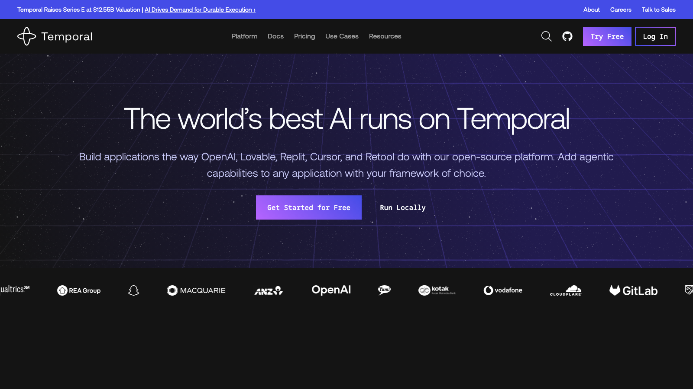

<!-- _class: title green billing -->

<div class="title-content">
<div class="conference-lockup">

<p class="conference">AshConf 2026</p>
</div>

<h1 class="title-lockup"><span>When Time</span><span>Meets State</span></h1>

<div class="title-footer">
<div class="speaker-lockup">
<p class="speaker">Conor Sinclair</p>
<p class="speaker-role">Lead Engineer at</p>

</div>
<div class="title-qr">

</div>
</div>
</div>

<!--
Today I want to talk about the dimension that is missing from how we model the real world. 
I want to talk about time.

#### But who am I

I'm lead engineer at Alembic, the expert Ash and Elixir consultancy, based in Australia. We have an amazing team of engineers all around the world 

Away from the keyboard, I'm a father. I have a three-year-old boy, and I live with my family in Spain.
I spend my summers teaching people how to weave willow into flower crowns at festivals across the UK.

But none of that will be appearing in this talk. 

no 
- willow weaving
- LLMs
- coding agents
-->

---

<!-- _class: define dark blob-peri conor-dictionary-slide -->

<p class="word">Time</p>
<p class="pron">NOUN &nbsp;·&nbsp; /tʌɪm/</p>

<div class="sense">
<p><span class="num">1.</span> the indefinite continued progress of existence and events in the past, present, and future regarded as a whole.</p>
<p><span class="num">2.</span> a point of time as measured in hours and minutes past midnight or noon.</p>
</div>

<p class="src">Oxford Dictionary of English</p>

<div class="conor-dictionary"></div>

<!--
But what is time? It's actually a really hard thing to define.

...

That comes close.
-->

---

<!-- _class: sources dark -->

<p class="eyebrow">Physics, asked three times</p>

# Nobody Else<br>Can Define It Either.

<div class="source-row">
<div>
<p class="source-claim">Quantum mechanics cannot measure time. Position is an operator. Time is a parameter handed in from outside, and Pauli proved no self-adjoint time operator is conjugate to an energy bounded below.</p>
<p class="source-cite">Galapon 1999 · ashconf26.sinclair.software/resources/pauli</p>
</div>
<div class="source-qr"></div>
</div>

<div class="source-row">
<div>
<p class="source-claim">Quantum gravity's central equation has no time in it. The Wheeler–DeWitt equation reads <code>ĤΨ = 0</code>. Isham reviewed every scheme for getting time back and endorsed none of them.</p>
<p class="source-cite">Isham 1992 · ashconf26.sinclair.software/resources/wheeler-dewitt</p>
</div>
<div class="source-qr"></div>
</div>

<div class="source-row">
<div>
<p class="source-claim">One answer is to give up on it. Rovelli: "the best strategy for understanding quantum gravity is to build a picture of the physical world where the notion of time plays no role."</p>
<p class="source-cite">Rovelli 2009 · ashconf26.sinclair.software/resources/rovelli</p>
</div>
<div class="source-qr"></div>
</div>

<!--
Ask a physicist 
- lengthy answer
- "we don't really know."

conflicting ideas, 
left out of a lot of different models.
-->

---

<!-- _class: dark blob-orange -->

<p class="eyebrow">Time — the missing dimension</p>

# Time.

Most business processes are missing a dimension.

<!--
Time is an intrinsic part of the world 
It's tied into everything at a very deep level.

But when we're modelling systems and processes

we treat it as an afterthought. 

Typically we're far more interested in the event itself more so than when it happened.
-->

---

<!-- _class: dark blob-peri -->

<p class="eyebrow">Ash Workflow reveal</p>

# Ash<br>Workflow

State learns to wait.

<!--
Throughout this talk 
I'll be diving into a new library I'm building, called Ash Workflow,

which aims to answer that disparity.
-->

---

<!-- _class: title orange -->

<div>

# Demo<br>Time
</div>

<!--
Before we dive into the library itself, I'm going to take a slightly unconventional turn and go straight into a demo.

For this I'm going to be inviting all attendees to apply for a job at the company I'm forming.
-->

---

<!-- _class: brand -->

<div class="brandmark">Only<span>Sands</span></div>

<p class="brand-tag">Premium content. Coarse material.</p>

<!--
It's called Only Sands. We ship small, confectionery-sized bags of sand all over the world.

You might be thinking, "Conor, why would I need a very small bag of sand?" For which I would answer: there are a ton of different uses.
-->

---

<!-- _class: product -->


<div class="product-copy">
<p class="eyebrow"><span class="mark">Only<span>Sands</span></span> · The product</p>

# Desk<br>Sand.

Tiny escapes. Bigger ideas.
</div>

<!--
Having a nice little island escape on your desk can be a huge boost to your mental health, clarity and focus.
-->

---

<!-- _class: operations dark -->

<div class="operations-copy">
<p class="eyebrow"><span class="mark">Only<span>Sands</span></span> · Research &amp; Development</p>

# Vertically<br>Integrated.

From plant pot to production in one carefully governed supply chain.
</div>

<div class="operations-visual"></div>

<!--
We're vertically integrated. 
Agents on the ground source the very best sediment, and our own couriers carry it to the customer's door.
-->

---

<!-- _class: shipment -->


<div class="shipment-copy">
<p class="eyebrow"><span class="mark">Only<span>Sands</span></span> · Global fulfilment</p>

# Sand.<br>Distributed.

Seven regions. Eight grain profiles. Absolutely normal packaging.
</div>

<!--
Seven regions, eight grain profiles. Getting a bag of sand through customs is harder than you might imagine.
-->

---

<!-- _class: hiring orange -->

<div class="job-card">
<p class="eyebrow"><span class="mark">Only<span>Sands</span></span> is hiring</p>
<div class="job-grid">
<div>

# Chief<br>Sediment<br>Architect

<p class="job-perks">Competitive base · equity · annual sand allowance</p>
</div>
<div class="job-meta">
Production Ash experience<br>
Distributed systems<br>
Granular data<br>
Eventual consistency<br>
<strong>Get your hands dirty</strong>
</div>
</div>
</div>

<!--
Which is why we're hiring a Chief Sediment Architect.

You'll need production Ash experience, distributed systems, granular data, eventual consistency, and a willingness to get your hands dirty.

In return, you'll get a competitive base, equity, and an annual sand allowance.
-->

---

<!-- _class: person orange -->

<div class="person-copy">
<p class="eyebrow"><span class="mark">Only<span>Sands</span></span> · Janine — HR Manager</p>

# Janine.

First gate · HR Manager · “Errrm… I don’t think so.”
</div>
<div class="portrait"></div>

<!--
But to get the job, you're going to need to get past our HR manager, Janine.

She's the first gate. She's going to screen you and decide whether you're worth the technical team's time.

She's a complete machine. Very methodical. She guarantees me an answer within seven seconds.
-->

---

<!-- _class: person dark -->

<div class="person-copy">
<p class="eyebrow">The Disclosure and Barring Service</p>

# The<br>Bureau.

DBS is the UK agency that runs criminal record checks. It rules on a developer’s past indiscretions from its own screen, in its own time, up to twenty seconds. 
</div>
<div class="portrait"></div>

<!--
The Disclosure and Barring Service 
checks applicants' criminal records. 

when you're moving sediment like this across seven continents, 
we need applicants to be squeaky clean.

The bureau is a fake third-party API we call out to. 

It goes looking for your past indiscretions and gives us a heads-up as you move through the process. 

It answers in its own time, up to twenty seconds

like most government APIs, it fails about half the time.
-->

---

<!-- _class: person peri -->

<div class="person-copy">
<p class="eyebrow"><span class="mark">Only<span>Sands</span></span> · Steve — Engineering Lead</p>

# Steve.

Engineering Lead. Definitely not the Big Boss.
</div>
<div class="portrait"></div>

<!--
With the background check result in hand, you speak to Steve, our engineering lead. That is, if he's got time.
-->

---

<!-- _class: person green -->

<div class="person-copy">
<p class="eyebrow"><span class="mark">Only<span>Sands</span></span> · Conor — The Big Boss</p>

# The<br>Big<br>Boss.

Final approval. Obviously.
</div>
<div class="portrait"></div>

<!--
And with all of that approved, you come through to me. The Big Boss. I make the final call. Though if I leave it long enough, the decision gets made for me.
-->

---

<!-- _class: qr peri -->

<div>
<p class="eyebrow"><span class="mark">Only<span>Sands</span></span> · Run the demo</p>

# Run it<br>yourself

github.com/team-alembic/ash_workflow/tree/main/demos/ats
</div>
<div class="qr-card"></div>

<!--
So if you wouldn't mind scanning this QR code.

It'll take you to an application form. Give me your name and a reason you should be Chief Sediment Architect at OnlySands.

-->

---

<!-- _class: subway dark -->

<p class="eyebrow">The demo, end to end</p>

<h1>The Hiring Line</h1>

<svg viewBox="0 0 1168 400" xmlns="http://www.w3.org/2000/svg" aria-label="The candidate moves from HR screen through DBS check, lead interview and final approval, ending hired or rejected">
  <defs>
    <clipPath id="janine-station"><circle cx="100" cy="160" r="35" /></clipPath>
    <clipPath id="bureau-station"><circle cx="375" cy="160" r="35" /></clipPath>
    <clipPath id="steve-station"><circle cx="650" cy="160" r="35" /></clipPath>
    <clipPath id="jefe-station"><circle cx="900" cy="160" r="35" /></clipPath>
  </defs>
  <g class="route-lines">
    <path class="line-main" d="M 100 160 H 1080" />
    <path class="line-out" d="M 100 160 L 135 205 V 315 H 1080" />
    <path class="line-out" d="M 375 160 L 410 205 V 315" />
    <path class="line-out" d="M 650 160 L 685 205 V 315" />
    <path class="line-out" d="M 900 160 L 935 205 V 315" />
  </g>
  <g class="route-avatar">
    <circle class="avatar-bg" cx="100" cy="160" r="38" />
    <image href="assets/janine-transparent.png" x="26" y="105" width="134" height="182" preserveAspectRatio="xMidYMin meet" clip-path="url(#janine-station)" />
    <circle class="avatar-frame" cx="100" cy="160" r="38" />
    <circle class="avatar-bg" cx="375" cy="160" r="38" />
    <image href="assets/dbs-bureau-pigeon.jpg" x="328" y="124" width="86" height="86" clip-path="url(#bureau-station)" />
    <circle class="avatar-frame" cx="375" cy="160" r="38" />
    <circle class="avatar-bg" cx="650" cy="160" r="38" />
    <image href="assets/steve-transparent.png" x="548" y="111" width="185" height="176" preserveAspectRatio="xMidYMin meet" clip-path="url(#steve-station)" />
    <circle class="avatar-frame" cx="650" cy="160" r="38" />
    <circle class="avatar-bg" cx="900" cy="160" r="38" />
    <image href="assets/conor-neutral-transparent.png" x="839" y="114" width="110" height="132" preserveAspectRatio="xMidYMin meet" clip-path="url(#jefe-station)" />
    <circle class="avatar-frame" cx="900" cy="160" r="38" />
  </g>
  <g class="route-stage">
    <text x="100" y="64">HR screen</text>
    <text x="375" y="64">DBS check</text>
    <text x="650" y="64">Lead interview</text>
    <text x="900" y="64">Final approval</text>
  </g>
  <g class="route-terminus">
    <circle class="hired" cx="1080" cy="160" r="26" />
    <circle class="rejected" cx="1080" cy="315" r="26" />
  </g>
  <g class="route-name">
    <text x="1080" y="105" class="end hired">Hired</text>
    <text x="1080" y="378" class="end rejected">Rejected</text>
  </g>
  <g class="route-continue">
    <text x="238" y="140">score ≥ 4</text>
    <text x="513" y="140">score ≥ 4</text>
    <text x="788" y="140">score ≥ 4</text>
    <text x="995" y="140">offer</text>
  </g>
  <g class="route-exit">
    <text x="148" y="250">score &lt; 4</text>
    <text x="423" y="250">score &lt; 4</text>
    <text x="698" y="250">score &lt; 4</text>
    <text x="948" y="250">veto</text>
  </g>
</svg>

<!--
Here's what you just watched, as a line on a map. 
HR screen, then the DBS check, then the lead interview, then final approval. Hired at the end of the line, and 
rejected as a possibility at any point.

In Ash applications we're very comfortable modelling this. 
There's a finite number of states, and known transitions between them.
-->

---

<!-- _class: code dark -->

<p class="eyebrow">AshStateMachine — every station, declared</p>

```elixir illustrative
state_machine do
  initial_states [:applied]
  default_initial_state :applied

  transitions do
    transition :screen,    from: :applied,   to: :screening
    transition :interview, from: :screening, to: :interview
    transition :hire,      from: :interview, to: :hired
    transition :reject,    from: [:screening, :interview], to: :rejected
  end
end
```

<p class="note">A transition the block does not list is refused. Transitions say what may happen. Not one of them says when.</p>

<!--
We have AshStateMachine, which gives us a really nice DSL for saying which state you start in and how you can get from one state to the next. Ash enforces it, so you can only move the way the block says. Very clean, very effective.

But it tells us nothing at all about time. Transitions say what may happen. Not one of them says when. What happens if something doesn't happen within a given time?

We're missing an entire dimension. This is purely the state.

What we need is a workflow: a set of steps that come together across time.
-->

---

<!-- _class: temporal dark -->

<div class="temporal-copy">
<p class="eyebrow">Temporal.io</p>

# Write code as if failure doesn’t exist

A durable execution engine. Your function sleeps for thirty days and wakes on the next line.

<a class="source" href="https://temporal.io/">Source: temporal.io</a>
</div>

<div class="temporal-shot">
<div class="chrome"><span class="lights"></span><span class="url">temporal.io</span></div>

</div>

<!--
There's already a SaaS product built around this idea, and it's been around for years. It's called Temporal.

Temporal is a durable execution engine. 

It lets you write a long running process as one function, even over days or weeks.  

This take infrastructure tho, Temporal runs as a separate service, workers poll it for work, and your workflow code has to be safe to replay.

For years, before I found Elixir, I really wanted this capability.
-->

---

<!-- _class: code dark -->

<p class="eyebrow">Temporal TypeScript</p>

```typescript
export async function candidate(id: string) {
  await sendToRecruiter(id);
  await sleep('30 days');

  if (await stillUndecided(id)) {
    await nudgeRecruiter(id);
    await sleep('7 days');
    await autoReject(id);
  }
}
```

<!--
Sorry I should have given a trigger warning. It's JavaScript.  this is code you might write in Temporal .

But I think what it expresses is something really quite powerful 

You can see some request going off to the recruiter. Then it sleeps for thirty days and comes back to check. If we still haven't decided, give them a nudge, another seven days, then auto-reject.

It's not particularly pretty. But I think it is powerful, and a really interesting idea: bringing real-world time into the business logic.
-->

---

<!-- _class: green blob-peri has-video -->

<p class="eyebrow">Oban</p>

# Jobs In<br>Postgres.

- A job is a row.
- Insert it in your transaction.
- A worker picks it up and runs it.

<video class="blob-video" src="assets/elephant-chase.mp4" autoplay loop muted playsinline aria-label="Conor chasing an elephant across the slide"></video>

<!--
So how do we model time in Elixir applications?

In Elixir we have Oban. Oban is a background job queue that keeps its jobs in your own database. A job is a row, inserting it is part of your transaction, and a worker picks it up and runs it.

It's great at firing off work that happens in isolation at a given time. You can schedule a job for a moment, or you can say that when certain criteria are met, go and do some work. And that runs in its own separate process.
-->

---

<!-- _class: code dark -->

<p class="eyebrow">AshOban — the timeout lives elsewhere</p>

```elixir illustrative
oban do
  triggers do
    trigger :auto_reject do
      action :reject
      where expr(state == :review and
              updated_at < ago(30, :second))
      scheduler_cron "* * * * *"
    end
  end
end
```

<!--
AshOban improves this by letting you declare the job itself on the resource instead of in a worker. 

Here's an example of how you'd define one of those triggers by hand.

The `scheduler_cron` tells us every minute to come along and run a check over that `where` clause. 

So in this instance, we look for anything with `state` in `:review`, and having been updated more than thirty seconds ago. 
Any record which match that `where` have the `:reject` action triggered. 

That's powerful, for sure. It isn't ergonomic. It's quite difficult to reason about exactly when this trigger will fire, and the timeout lives nowhere near the state it governs.

But it does mean we have the other half of what we need: time going forwards, and transitions between known states.
-->

---

<!-- _class: green -->

<p class="eyebrow">Ash Workflow</p>

# Ash Workflow

<div class="flow"><span>AshStateMachine</span><b>+</b><span>AshOban</span></div>

<!--
That's all Ash Workflow is. An ergonomic wrapper around a state machine and Oban.

States and transitions on one side. Scheduled work on the other.
-->

---

<!-- _class: code small dark -->

<p class="eyebrow">The whole workflow</p>

```elixir ash_workflow:ats_workflow
workflow do
  step :hr_screen do
    timeout :janine_responds do
      fire_after {7, :seconds}
      transition_to :hr_decision
    end
  end

  step :hr_decision do
    action :record_hr_screen

    on_success :request_dbs, when: expr(score >= 4)
    on_error :rejected
  end

  step :request_dbs do
    action :call_the_bureau
    on_success :background_check
    on_error :rejected
  end

  step :background_check do
    transition :dbs_clear, to: :final_approval
    transition :dbs_flag, to: :final_approval

    every :chase_the_bureau do
      interval {20, :seconds}
      action :chase_dbs
    end
  end

  step :final_approval do
    transition :offer, to: :hired
    transition :veto, to: :rejected

    timeout :jefe_no_answer do
      fire_after {45, :seconds}
      transition_to :rejected
    end
  end

  step :hired
  step :rejected
end
```

<!--
So what does a workflow look like?

You start with a `workflow` block, and inside it a set of known steps the workflow can be in. Then the time dimension can be added on top, which I'll go into in more depth in a second.

Here are some of the steps we saw in the demo. 
The `:hr_screen` right at the top there, will be the first step the workflow starts in when this resource is created.

Then there are transitions which can be triggered at various steps in the workflow, and some actions being called with their results determining what step should occur next.
-->

---

<!-- _class: code dark -->

<p class="eyebrow">A step someone has to move</p>

```elixir ash_workflow:review
step :review do
  transition :hire, to: :hired
  transition :reject, to: :rejected

  timeout :auto_reject do
    fire_after {30, :seconds}
    transition_to :auto_rejected
  end
end
```

<!--
Lets look a bit closer at some of these steps. 

Here we have an example of a step which will require someone, or something outside the workflow, to move. 
Once we reach this review step, somebody has to come and transition it. They say `hire` or `reject`, and that moves the record to the next known state.

But there's another block here, a timeout, which says that if thirty seconds pass and we haven't left this state, transition them to `auto_rejected`.
-->

---

<!-- _class: code dark -->

<p class="eyebrow">A step that moves itself</p>

```elixir ash_workflow:verifying
step :verifying do
  action :run_verification

  on_success :review, when: expr(score > 4)
  on_success :rejected
  on_error :verification_failed
end
```

<!--
Another step here is showcasing how an arbitrary action can be wrapped in a step, with its result dictating what will happen next. 

The moment you enter the step, the action fires, `run_verification` in this case. Then, depending on the result, you say where success goes and where an error goes. 

As you can see `on_success` can also be conditional: and route to a step based on the action's result.
-->

---

<!-- _class: orange -->

# Policies<br>Still Apply

Transitions are just Ash actions.

<!--
These are all just Ash actions. And since transitioning between steps is an Ash action, you can attach policies to them.
-->

---

<!-- _class: code dark -->

<p class="eyebrow">Only the big boss</p>

```elixir ash_workflow:policy
step :review do
  policy actor_attribute_equals(:role, :recruiter)

  transition :hire, to: :hired
  transition :reject, to: :rejected
end
```

<!--
On this review step, only an actor with the role of recruiter can transition to hired or rejected. And you can put arbitrary rules in there.
-->

---

<!-- _class: google-calendar -->

<div class="gcal" aria-label="October 2026 calendar showing a start date, reminder two days later, and escalation seven days after the start">
  <header class="gcal-header">
    <span class="gcal-menu">☰</span>
    <span class="gcal-app-icon">20</span>
    <strong>Calendar</strong>
    <span class="gcal-today">Today</span>
    <span class="gcal-chevron">‹</span><span class="gcal-chevron">›</span>
    <span class="gcal-month-title">October 2026</span>
    <span class="gcal-header-spacer"></span>
    <span class="gcal-tool">⌕</span><span class="gcal-tool">?</span><span class="gcal-tool">⚙</span>
    <span class="gcal-view">Month <i class="caret"></i></span>
    <span class="gcal-grid-icon">⠿</span>
    <span class="gcal-avatar">C</span>
  </header>
  <aside class="gcal-sidebar">
    <div class="gcal-create"><b>+</b> Create <i class="caret"></i></div>
    <div class="mini-title"><strong>October 2026</strong><span class="mini-nav"><span>‹</span><span>›</span></span></div>
    <div class="mini-weekdays"><span>M</span><span>T</span><span>W</span><span>T</span><span>F</span><span>S</span><span>S</span></div>
    <div class="mini-days">
      <span class="outside">28</span><span class="outside">29</span><span class="outside">30</span><span>1</span><span>2</span><span>3</span><span>4</span>
      <span>5</span><span>6</span><span>7</span><span>8</span><span>9</span><span>10</span><span>11</span>
      <span class="mini-start">12</span><span>13</span><span class="mini-remind">14</span><span>15</span><span>16</span><span>17</span><span>18</span>
      <span class="mini-escalate">19</span><span>20</span><span>21</span><span>22</span><span>23</span><span>24</span><span>25</span>
      <span>26</span><span>27</span><span>28</span><span>29</span><span>30</span><span>31</span><span class="outside">1</span>
    </div>
    <div class="gcal-sidebar-heading">My calendars <i class="caret up"></i></div>
    <div class="gcal-calendar-name"><i></i> Workflow deadlines</div>
  </aside>
  <main class="gcal-month">
    <div class="gcal-weekdays"><span>MON</span><span>TUE</span><span>WED</span><span>THU</span><span>FRI</span><span>SAT</span><span>SUN</span></div>
    <div class="gcal-days">
      <div class="outside"><b>28</b></div><div class="outside"><b>29</b></div><div class="outside"><b>30</b></div><div><b>1</b></div><div><b>2</b></div><div><b>3</b></div><div><b>4</b></div>
      <div><b>5</b></div><div><b>6</b></div><div><b>7</b></div><div><b>8</b></div><div><b>9</b></div><div><b>10</b></div><div><b>11</b></div>
      <div><b>12</b><span class="gcal-event start">START</span></div><div><b>13</b></div><div><b>14</b><span class="gcal-event remind">REMIND</span></div><div><b>15</b></div><div><b>16</b></div><div><b>17</b></div><div><b>18</b></div>
      <div><b>19</b><span class="gcal-event escalate">ESCALATE</span></div><div><b>20</b></div><div><b>21</b></div><div><b>22</b></div><div><b>23</b></div><div><b>24</b></div><div><b>25</b></div>
      <div><b>26</b></div><div><b>27</b></div><div><b>28</b></div><div><b>29</b></div><div><b>30</b></div><div><b>31</b></div><div class="outside"><b>1</b></div>
    </div>
  </main>
</div>

<!--
You can also have more than one deadline on a single step.

Say you came into the review state on Monday the twelfth. You could be reminded two days later, and then a week after that escalated into some other state.
-->

---

<!-- _class: code dark -->

<p class="eyebrow">Two deadlines, one step</p>

```elixir ash_workflow:timeouts
timeout :reminder do
  fire_after {2, :days}
  action :send_review_reminder
end

timeout :escalation do
  fire_after {7, :days}
  transition_to :escalated_review
end
```

<!--
That's expressible with two timeout blocks. After two days, trigger that action. After seven days, transition to an entirely different state.
-->

---

<!-- _class: code dark -->

<p class="eyebrow">How AshOban finds work</p>

```elixir illustrative
trigger :auto_reject do
  where expr(state == :review and
          state_entered_at <= ago(30, :second))
  scheduler_cron "* * * * *"   # <- the ceiling
end
```

<!--
So how does this actually run?

AshOban checks for records still in `review` whose thirty-second deadline has passed. On each cron tick, it finds the matches and queues the work.

That means the deadline is a condition on the record, not a job we insert when the record enters `review`. 

An astute eye may spot that Cron only checks once a minute, so that means we actually can't express anything finer grain, like 30 seconds say, as the exact instant of firing will be at most 30 seconds later
-->

---

<!-- _class: orange blob-peri -->

<p class="eyebrow">The obvious question</p>

# Why Not Schedule<br>The Exact Instant?

A scheduled job puts the deadline in two places: the record and the queue. Leave `review` and you cancel it. Move the deadline and you reschedule it.

The cron query asks the record, so there is no future job to keep in sync.

<!--
Why not schedule the exact instant?

We could. Oban can store a job to be run at an exact point in time.

But now the deadline lives in two places: on the workflow record and in the job queue. If the record leaves `review`, we need to cancel its job. If its deadline moves, we need to reschedule it. And if the job has already started, cancellation is too late—the worker must check whether the timeout still applies before doing anything.

With the cron query, the current record decides what’s due. There’s no future job to keep in sync.
-->

---

<!-- _class: dark blob-peri -->

<p class="eyebrow">Cron versus a BEAM timer</p>

# 60 Seconds<br>Versus<br>Milliseconds

Cron runs a query on a schedule. It never learns the deadline.

<!--
Lets take a slight detour, so that the demo runs faster than one transition a minute.
Since Cron has at most a single minute precision
-->

---

<!-- _class: dark oban-loop -->

<p class="eyebrow">How Oban keeps time</p>

# A Process That Wakes Itself

<svg viewBox="0 0 1160 420" role="img" aria-label="A GenServer sends itself a message after sixty seconds, runs one query against the candidates table, and inserts a job for every row it finds">
<defs>
<marker id="loop-arrow" viewBox="0 0 10 10" refX="9" refY="5" markerWidth="6" markerHeight="6" orient="auto-start-reverse">
<path d="M 0 0 L 10 5 L 0 10 z" fill="#8fa1ff"/>
</marker>
<filter id="pulse-glow" x="-200%" y="-200%" width="500%" height="500%">
<feGaussianBlur stdDeviation="7" result="blur"/>
<feMerge><feMergeNode in="blur"/><feMergeNode in="SourceGraphic"/></feMerge>
</filter>
</defs>

<path id="self-loop" class="loop-edge" d="M 300 188 C 340 44 90 44 138 186"/>
<text class="loop-label" x="220" y="36">send_after(self(), :work, 60_000)</text>

<g class="proc">
<rect x="88" y="188" width="392" height="104" rx="26"/>
<line class="proc-divider" x1="192" y1="188" x2="192" y2="292"/>
<rect class="mailbox-flash" x="90" y="190" width="100" height="100" rx="24"/>
<text class="proc-name" x="336" y="248">Oban.Cron</text>
<text class="proc-role" x="140" y="322">mailbox</text>
</g>

<circle class="pulse" cx="0" cy="0" r="10" filter="url(#pulse-glow)"/>

<path class="query-edge" d="M 480 240 H 528"/>
<g class="store">
<ellipse class="store-lid" cx="632" cy="196" rx="88" ry="20"/>
<path class="store-body" d="M 544 196 V 284 A 88 20 0 0 0 720 284 V 196"/>
<text class="store-name" x="632" y="248">candidates</text>
<text class="store-note" x="632" y="336">one query</text>
</g>

<g class="fan">
<path class="fan-edge e1" d="M 720 228 C 772 228 772 124 812 124"/>
<path class="fan-edge e2" d="M 720 240 H 812"/>
<path class="fan-edge e3" d="M 720 252 C 772 252 772 356 812 356"/>
<path class="fan-tip e1" d="M 794 113 L 818 124 L 794 135 Z"/>
<path class="fan-tip e2" d="M 794 229 L 818 240 L 794 251 Z"/>
<path class="fan-tip e3" d="M 794 345 L 818 356 L 794 367 Z"/>
<g class="job j1"><rect x="818" y="94" width="286" height="60" rx="30"/><text x="961" y="132">auto_reject 9f2</text></g>
<g class="job j2"><rect x="818" y="210" width="286" height="60" rx="30"/><text x="961" y="248">auto_reject a71</text></g>
<g class="job j3"><rect x="818" y="326" width="286" height="60" rx="30"/><text x="961" y="364">auto_reject c04</text></g>
</g>
</svg>

The timer never learns a deadline. It only decides how often the question gets asked.

<!--
First, how Oban works internally.

It's a GenServer on a loop, sending itself a message and then checking the database for work. It asks what fits this where clause, and anything that matches gets spun off into its own job and executed.

We can do a similar thing. If we wanted millisecond precision we could call a GenServer every millisecond looking for work. But there's always going to be lag.
-->

---

<!-- _class: dark blob-green blob-low narrow -->

<p class="eyebrow">How a sequencer keeps time</p>

# Two<br>Clocks.

A sequencer never plays a note from the loop that wakes it. The loop looks ahead and hands each note in the window to the audio clock.

`Precise` splits the same two clocks. The sweep reads every deadline inside `horizon_ms` and arms a BEAM timer for each exact instant.

<!--
The solution comes from audio programming: run two clocks.

There's the current time, and then whenever the GenServer looks for work it looks over a horizon. Over the next ten milliseconds, or a full second, which jobs are about to match that where clause? Then you schedule those precisely, because you can tell the BEAM to run something at exactly this instant.

That's lookahead. The reason you need it in audio is that you cannot block the main thread. To the human ear it's incredibly obvious the moment you're a few milliseconds out — things start sounding muddy.

So if you're writing a sequencer, you keep the map of when the notes are supposed to hit, and you hand each one to the dedicated audio thread ahead of time, saying: at this instant, I want this to happen. It handles the precision.

A sequencer never plays a note from the loop that wakes it.
-->

---

<!-- _class: code dark -->

<p class="eyebrow">Lookahead — arm the timer, don’t poll</p>

```elixir ash_workflow:scheduler
workflow do
  scheduler AshWorkflow.Scheduler.Precise
end
```

<!--
So I ended up writing a new scheduler, and it's configurable. You say use the precise scheduler instead, and it holds the GenServer doing the lookahead.
-->

---

<!-- _class: dark blob-green -->

<p class="eyebrow">Naive timestamp</p>

# State_Entered_At

Simple. Indexable. Easy to schedule against.

<!--
So how do we actually look into the future?

A very simple timestamp field called `state_entered_at`. Every time you transition, we stamp exactly when you entered. From there we can look ahead: we're seven days from then, so this one is about to fire.
-->

---

<!-- _class: code dark -->

<p class="eyebrow">One indexed column</p>

```elixir illustrative
attribute :state_entered_at, :utc_datetime_usec

where expr(state == :review and
        state_entered_at <= ago(30, :second))
```

<!--
One single indexed column to look up. Anything in the review state — did we enter it more than thirty seconds ago?
-->

---

<!-- _class: orange -->

<p class="eyebrow">Recurring actions</p>

# The Anchor<br>Keeps Moving

Reminders obscure when the state actually began.

<!--
We have a slight problem when we get to recurring actions.
-->

---

<!-- _class: code dark -->

<p class="eyebrow">Running an action every interval</p>

```elixir ash_workflow:timeouts
every :reminder do
  interval {2, :days}
  action :send_review_reminder
end
```

<!--
Here's the DSL: every two days, trigger this action. You can put it on any step, with any interval.

The naive approach to having a feature like this is to just reset the `state_entered_at` field, which will work, that will prevent the same action from firing over and over, and signal that it needs to happen again the next interval.
-->

---

<!-- _class: code dark -->

<p class="eyebrow">Put a deadline next to it</p>

```elixir ash_workflow:review_nudge
step :review do
  every :nudge do
    interval {2, :days}
    action :send_review_reminder
  end

  timeout :breach, fire_after: {7, :days},
    transition_to: :escalated
end
```

<p class="note">Both measure from the same column. If the nudge moved it, the breach would be seven days away again every two days, and never arrive.</p>

<!--
If you put a timeout next to it, we have a bug. Both of these measure from the same column. If the nudge moved it, the breach would be seven days away again every two days, and never arrive.
-->

---

<!-- _class: dark anchor-drift -->

<p class="eyebrow">Nine days in review, nudged every two</p>

# The Breach Never Arrives

<svg viewBox="0 96 1160 272" role="img" aria-label="A timeline of sixteen days. Every two days a nudge moves state_entered_at forward, and the seven-day breach deadline moves with it, staying ahead of now.">
<line class="ad-axis" x1="80" y1="250" x2="1104" y2="250"/>
<g class="ad-ticks">
<path d="M 80 242 V 258 M 208 242 V 258 M 336 242 V 258 M 464 242 V 258 M 592 242 V 258 M 720 242 V 258 M 848 242 V 258 M 976 242 V 258 M 1104 242 V 258"/>
<text x="80" y="288">0</text><text x="208" y="288">2</text><text x="336" y="288">4</text><text x="464" y="288">6</text><text x="592" y="288">8</text><text x="720" y="288">10</text><text x="848" y="288">12</text><text x="976" y="288">14</text><text x="1104" y="288">16</text>
<text class="ad-unit" x="1104" y="322">days</text>
</g>

<g class="ad-nudges">
<circle class="ad-nudge n1" cx="208" cy="250" r="9"/>
<circle class="ad-nudge n2" cx="336" cy="250" r="9"/>
<circle class="ad-nudge n3" cx="464" cy="250" r="9"/>
<circle class="ad-nudge n4" cx="592" cy="250" r="9"/>
<text class="ad-nudge-label n1" x="208" y="352">every :nudge</text>
</g>

<g class="ad-breach">
<line x1="528" y1="186" x2="528" y2="272"/>
<text x="514" y="170">timeout :breach</text>
</g>

<g class="ad-anchor">
<line x1="80" y1="176" x2="80" y2="272"/>
<text x="94" y="318">state_entered_at</text>
</g>

<g class="ad-now">
<line x1="80" y1="128" x2="80" y2="292"/>
<text x="80" y="114">now</text>
</g>
</svg>

Every nudge moves the anchor. The seven-day breach moves with it.

<!--
Watch it happen. Nine days in review, nudged every two. Every nudge drags the anchor forward, and the breach line moves with it. The deadline is always seven days away, and it never arrives.
-->

---

<!-- _class: green -->

<p class="eyebrow">Transition log</p>

# Transition<br>Log

from · to · action · actor · time

<!--
So far we've been looking into the future. What happens when we want to look into the past?

The answer ends up being a log of transitions. Keeping track of what the state was, what its becoming, what ran action, who the actor was, and when.

It keeps track of when you moved into a state, so you have the full history, and you get a history view of when things happened.
-->

---

<!-- _class: code dark -->

<p class="eyebrow">Opt in — a resource you own</p>

```elixir ash_workflow:transition_log
workflow do
  transition_log MyApp.CandidateTransition
end
```

<!--
It's an additional resource that your application controls, which you reference from your workflow. You say the transition log is this module
-->

---

<!-- _class: code dark -->

<p class="eyebrow">The generator writes it for you</p>

```bash
mix ash_workflow.gen.transition_log MyApp.Candidate
```

<!--
It's a very basic resource, and you can generate one with the right shape with this mix task.
-->

---

<!-- _class: code dark -->

<p class="eyebrow">Reading the history back</p>

```elixir illustrative
Candidate.history(candidate)
#=> [%CandidateTransition{...}, ...]

Candidate.state_at(candidate, ~U[2026-08-26 14:02:00Z])
#=> :review
```

<!--
And it gives you a couple of nice conveniences. You can read the history of every transition, and you can ask what the state was at a specific time.
-->

---

<!-- _class: peri -->

<p class="eyebrow">Undo</p>

# Undo.

Bounded. Actor-aware. Recorded as another event.

<!--
This also means a new feature drops out of it very simply: undo. You look at the log, take the last transition, and reverse it.
-->

---

<!-- _class: code dark -->

<p class="eyebrow">A window in which to change your mind</p>

```elixir ash_workflow:undo
undo do
  within {30, :minutes}
  same_actor? true
end

step :review do
  transition :hire, to: :hired, undoable?: true
end
```

<!--
We can put that in the DSL. Certain transitions are marked undoable, so if I hire someone I can undo it immediately. And there's a block where you say only within the next thirty minutes, and only by the same actor. You can put additional conditions on there.

> If there's time, demo the /timeline

Let me show the log in action. We have this playhead, and we can see the state of every candidate as it happened. They started, Janine responded, I vetoed, and then I undid that veto. We can scroll back and see exactly what the state was at a given point, which is pretty handy.
-->

---

<!-- _class: dark blob-peri -->

# Temporal<br>Resources

Validity periods. Historical rows. “As of” reads.

<!--
Finding out what the state was at a given point is something a new Ash feature aims to tackle, and that's temporal resources. Zach talked about this in his talk at Goatmire.
-->

---

<!-- _class: code dark -->

<p class="eyebrow">Experimental · needs Postgres 19</p>

```elixir illustrative
temporal do
  strategy :context
  attribute :valid_at
end

Ash.get!(Candidate, id,
  as_of: ~U[2026-08-26 14:02:00Z])
```

<!--
It's exciting, it's new, and it's PostgreSQL only. You get an as-of read.

You put a `temporal` block on the resource, say the strategy is context and the attribute is `valid_at`. Instead of one record you have many: each change is its own row in the database, and the only thing that tells you which one is correct is the date you're asking about.

So depending on when you are — most likely right now — you can go and time travel, and pick up the row that was true then.
-->

---

<!-- _class: peri -->

<p class="eyebrow">QR callback</p>

# Rewind<br>The Board

Return to the exact instant the audience applied.

<!--
Either of those approaches lets us rewind the board and see exactly where we were at a given point.
-->

---

<!-- _class: orange -->

<p class="eyebrow">Can we drop the column?</p>

# Drop The<br>Column?

So…

<!--
So could we drop the column?
-->

---

<!-- _class: dark blob-orange blob-low -->

<p class="eyebrow">Temporal lower bounds</p>

# Unrelated Writes<br>Reset The Clock

Row-version time is not workflow-state time.

<!--
You have to be careful with temporal resources, because when other fields change it moves the bound you might have been anchoring to. Row-version time is not workflow-state time.

You couldn't have `valid_at` drive the whole workflow if you needed specific times. You have to keep track of the state transition yourself.
-->

---

<!-- _class: green compare -->

<p class="eyebrow">Log versus temporal</p>

# Two Histories

<div class="comparison"><div><b>Event log</b><span>How did it get here?</span></div><div><b>Temporal rows</b><span>What did it look like?</span></div></div>

<!--
That's all unreleased, and mostly of interest. But which should you go for in your own applications? Which is the right abstraction for dealing with time?

Do you want an event log of everything that happened, or temporal rows where the database tells you exactly what the data looked like?

The split ends up being: if you want to know how you got there, you want an event log. If you want to know what it looked like — what every field ended up being — you want temporal rows.
-->

---

<!-- _class: code dark -->

<p class="eyebrow">Values versus events</p>

```elixir illustrative
Candidate
|> Ash.Query.filter(state == :review)
|> Ash.Query.as_of(~U[2026-07-31 23:59:59Z])
|> Ash.count!()
```

<!--
Here’s a question: how many candidates were in review at the end of July?

With temporal resources, I can ask that directly: filter for `review`, look at the records as they were on that date, and count them.
-->

---

<!-- _class: code dark -->

<p class="eyebrow">The same count, from the log</p>

```elixir illustrative
calculations do
  calculate :state_at, :atom,
    expr(first(transitions,
      field: :to_state,
      query: [
        filter: occurred_at <= ^arg(:at),
        sort: [occurred_at: :desc]
      ]
    )) do
    argument :at, :utc_datetime_usec, allow_nil?: false
  end
end

Candidate
|> Ash.Query.filter(state_at(at: ^~U[2026-07-31 23:59:59Z]) == :review)
|> Ash.count!()
```

<!--
Our transition log can answer it too. For each candidate, find the last transition before that date and count those that landed in `review`. 

The difference is what we’ve kept. The log records **workflow events**: when a candidate moved and why. Temporal resources preserve **past versions of the record**, so we can ask what its other fields looked like then, too.
-->

---

<!-- _class: green closing -->

<div class="closing-copy">
<p class="eyebrow">Thank you</p>

# Model<br>Time.

<div class="terminal">
<button class="copy" type="button" onclick="navigator.clipboard.writeText('mix igniter.install ash_workflow');this.textContent='copied'">copy</button>
<pre><code>mix igniter.install ash_workflow</code></pre>
</div>
</div>

<div class="closing-links">

<div class="link-card">
<p class="link-head"><svg viewBox="0 0 24 24" aria-hidden="true"><path d="M12 .5C5.37.5 0 5.87 0 12.5c0 5.3 3.44 9.8 8.21 11.39.6.11.82-.26.82-.58v-2.03c-3.34.73-4.04-1.61-4.04-1.61-.55-1.39-1.34-1.76-1.34-1.76-1.09-.75.08-.73.08-.73 1.21.09 1.84 1.24 1.84 1.24 1.07 1.84 2.81 1.31 3.5 1 .11-.78.42-1.31.76-1.61-2.67-.3-5.47-1.34-5.47-5.96 0-1.32.47-2.4 1.24-3.25-.13-.3-.54-1.52.12-3.18 0 0 1.01-.32 3.3 1.24a11.5 11.5 0 0 1 6 0c2.29-1.56 3.3-1.24 3.3-1.24.66 1.66.25 2.88.12 3.18.77.85 1.24 1.93 1.24 3.25 0 4.63-2.81 5.65-5.49 5.95.43.37.81 1.1.81 2.22v3.29c0 .32.21.7.83.58C20.57 22.29 24 17.8 24 12.5 24 5.87 18.63.5 12 .5z"/></svg> team-alembic/ash_workflow</p>

</div>

<div class="link-card">
<p class="link-head"><svg viewBox="0 0 24 24" aria-hidden="true"><path d="M12 1.2 21.4 6.6v10.8L12 22.8 2.6 17.4V6.6L12 1.2Zm0 4.1L6.2 8.65v6.7L12 18.7l5.8-3.35v-6.7L12 5.3Z"/></svg> hexdocs.pm/ash_workflow</p>

</div>

</div>

<!--
So there we have it.
This has been When Time Meets State, and I hope you found it interesting.

It's been a lot of fun writing this library. It's on Hex, and the code is on GitHub, and both are on the slide with a QR code under each. The install command is there too, if you want to start now.

Contributions are welcome. Use it, try to break it, have some fun with it.

But for the most part, just try to think about time as an essential ingredient when you're modelling your application state.

Thank you very much. I've been Conor Sinclair. See you around.
-->
